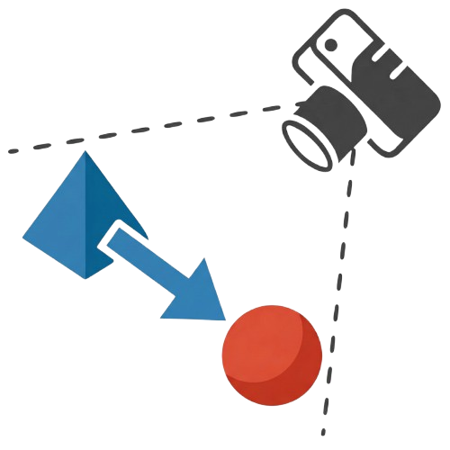

<div align="center">

#  <span style="color: #FF7096;">SpaRRTa</span>: A Synthetic Benchmark for Evaluating Spatial Intelligence in Visual Foundation Models


[](https://github.com/pre-commit/pre-commit)
[](https://pytorch.org/get-started/locally/)
[](https://www.unrealengine.com/)
[](https://hydra.cc/)
[](https://github.com/gmum/SpaRRTa/blob/main/LICENSE)

[**Project Page**](https://sparrta.gmum.net/) | [**Paper**](https://arxiv.org/pdf/2601.11729) | [**arXiv**](https://arxiv.org/abs/2601.11729) | [**HuggingFace Model**](https://huggingface.co/turhancan97/SpaRRTa-probes) | [**HuggingFace Space**](https://huggingface.co/spaces/turhancan97/SpaRRTa-demo) | [**Dataset**](https://huggingface.co/datasets/turhancan97/SpaRRTa) | [**Twitter/X**](https://x.com/turhancan97/status/2019373429804396989) | [**YouTube Video**]()

[Turhan Can Kargin](https://turhancankargin.me/), [Wojciech Jasiński](https://www.linkedin.com/in/wojciechjasinski/), [Adam Pardyl](https://adam.pardyl.com/),  [Bartosz Zieliński](https://bartoszzielinski.github.io/), [Marcin Przewięźlikowski](https://mprzewie.github.io/)
</div>

:newspaper: **NEWS**:

- *Mar. 2026:* Model and demo space are available on [HuggingFace Model](https://huggingface.co/turhancan97/SpaRRTa-probes) and [HuggingFace Space](https://huggingface.co/spaces/turhancan97/SpaRRTa-demo).
- *Mar. 2026:* Scene generation pipeline is available on [GitHub](https://github.com/gmum/SpaRRTa/tree/main/unreal-scene-gen).
- *Mar. 2026:* Dataset is available on [HuggingFace](https://huggingface.co/datasets/turhancan97/SpaRRTa).
- *Jan. 2026:* Codebase will be released soon!
- *Jan. 2026:* Paper is available on [arXiv](https://arxiv.org/abs/2601.11729).

--------------------------------

If you find this research useful, please consider citing:

```bibtex
@misc{kargin2026sparrta,
  title={SpaRRTa: A Synthetic Benchmark for Evaluating Spatial Intelligence in Visual Foundation Models},
  author={Turhan Can Kargin and Wojciech Jasiński and Adam Pardyl and Bartosz Zieliński and Marcin Przewięźlikowski},
  year={2026},
  eprint={2601.11729},
  archivePrefix={arXiv},
  primaryClass={cs.CV},
  url={https://arxiv.org/abs/2601.11729}
}