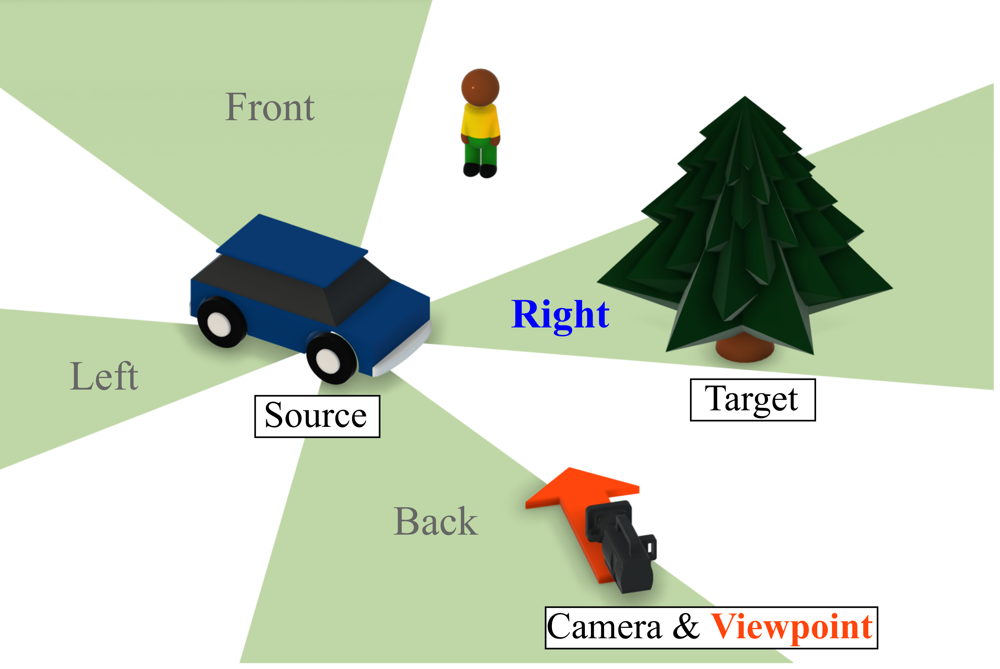
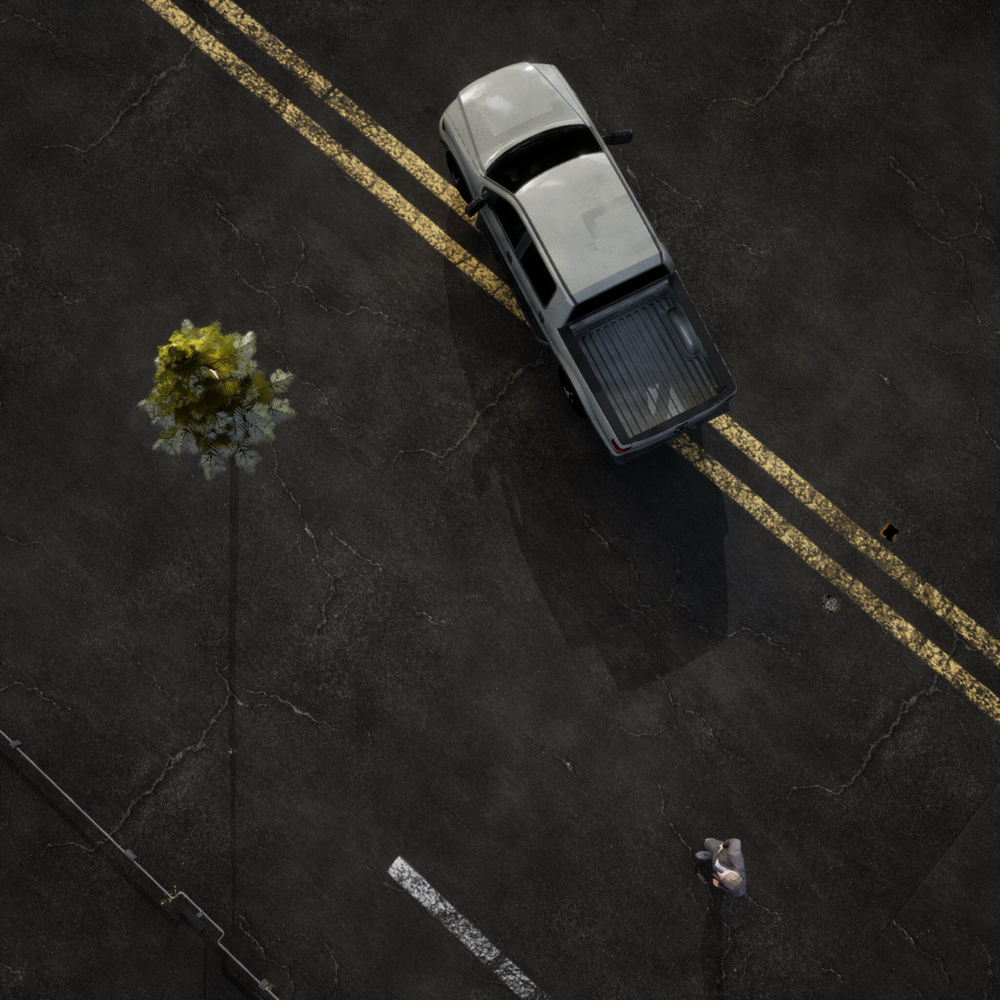
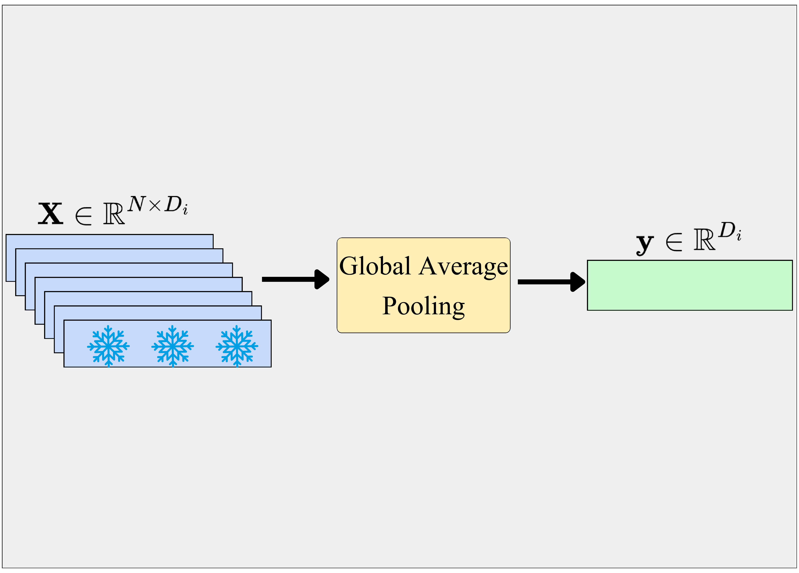
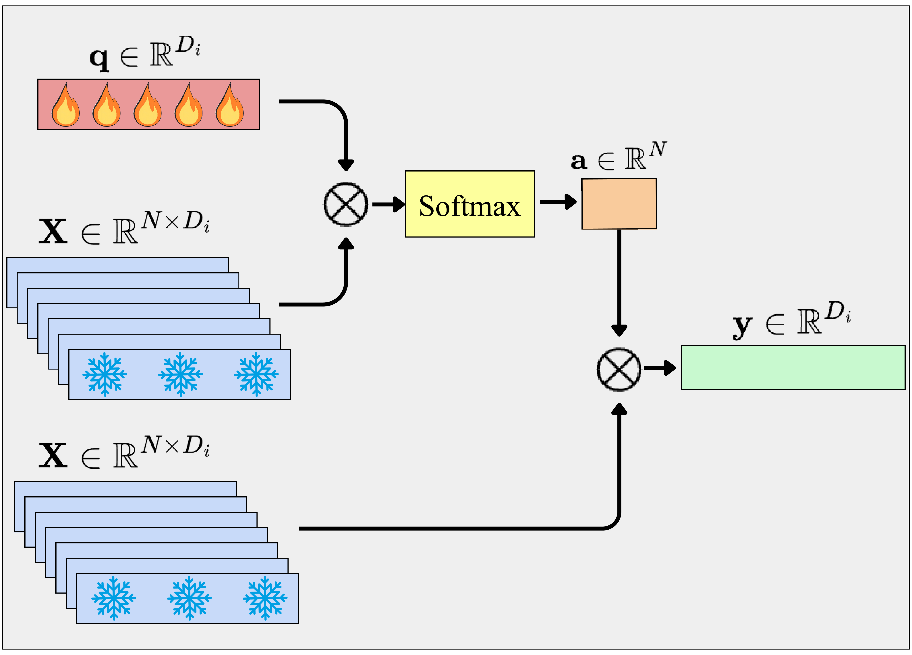

# Evaluation of Visual Foundation Models

SpaRRTa provides a systematic methodology for evaluating how Visual Foundation Models (VFMs) encode and represent spatial relations between objects.

## The Spatial Relation Recognition Task

The core task is to determine the **relative spatial relation** between two objects in an image:

- **Source Object**: The reference point for the spatial relation
- **Target Object**: The object whose position is being queried
- **Viewpoint**: The perspective from which the relation is evaluated

<div class="comparison-container">
  <div class="comparison-panel" style="padding: 0;">
    
  </div>
  <div class="comparison-panel" style="padding: 0;">
    
  </div>
</div>
<p style="text-align: center; color: var(--sparrta-text-secondary); margin-top: 0.5rem;"><strong>Left:</strong> Egocentric task (camera viewpoint). <strong>Right:</strong> Allocentric task (human viewpoint).</p>

### Task Variants

=== "Egocentric (SpaRRTa-ego)"

    The **camera** defines the viewpoint for spatial relations.
    
    !!! example "Example Query"
        "Where is the **tree** (target) relative to the **car** (source) from the **camera's** perspective?"
    
    **Characteristics:**
    
    - Directly observable from input image
    - Simpler—no perspective transformation needed
    - Tests basic spatial layout understanding
    
    **Answer**: The relation as seen from the camera (Front/Back/Left/Right)

=== "Allocentric (SpaRRTa-allo)"

    A **third object** (human) defines the viewpoint for spatial relations.
    
    !!! example "Example Query"
        "Where is the **tree** (target) relative to the **car** (source) from the **human's** perspective?"
    
    **Characteristics:**
    
    - Requires implicit perspective transformation
    - More challenging—must reason from another viewpoint
    - Tests abstract spatial reasoning capability
    
    **Answer**: The relation as would be seen from the human's position

### Classification Labels

The task is formulated as a **4-way classification**:

| Label | Description |
|-------|-------------|
| **Front** | Target is in front of source (from viewpoint) |
| **Back** | Target is behind source (from viewpoint) |
| **Left** | Target is to the left of source (from viewpoint) |
| **Right** | Target is to the right of source (from viewpoint) |

## Evaluated Models

We evaluate a diverse suite of VFMs spanning different learning paradigms:

### Joint-Embedding Architectures (JEA)

| Model | Backbone | Pre-training | Dataset |
|-------|----------|--------------|---------|
| **DINO** | ViT-B/16 | Contrastive / Distillation | ImageNet-1k |
| **DINO-v2** | ViT-B/14 | DINO + iBOT | LVD-142M |
| **DINO-v2 (+reg)** | ViT-B/14, ViT-L/14 | DINO-v2 w/ Register Tokens | LVD-142M |
| **DINOv3** | ViT-B/16 | DINO + iBOT | LVD-1689M |

### Masked Image Modeling (MIM)

| Model | Backbone | Pre-training | Dataset |
|-------|----------|--------------|---------|
| **MAE** | ViT-B/16 | Pixel Reconstruction | ImageNet-1k |
| **MaskFeat** | ViT-B/16 | HOG Feature Prediction | ImageNet-1k |
| **SPA** | ViT-B/16 | Masked Volumetric Neural Rendering | ScanNet, Hypersim, S3DIS |
| **CroCo** | ViT-B/16 | Cross-View Completion | Habitat |
| **CroCov2** | ViT-B/16 | Cross-View Completion | ARKitScenes, MegaDepth, ... |

### Supervised & Weakly Supervised

| Model | Backbone | Pre-training | Dataset |
|-------|----------|--------------|---------|
| **VGGT** | ViT-L/14 | Multi-Task 3D Regression | Co3D, MegaDepth, etc. |
| **DeiT** | ViT-B/16 | Classification + Distillation | ImageNet-1k |
| **CLIP** | ViT-B/16 | Image-Text Contrastive | Web Image-Text (WIT) |

## Interactive Prediction Demo

Explore spatial relation predictions from the **VGGT** model using our interactive demo. Select an environment and viewpoint to see how the model predicts spatial relations between objects.

<div class="prediction-demo-container">
  <div class="prediction-demo-controls">
    <div class="prediction-demo-select-group">
      <label for="prediction-env-select">Environment:</label>
      <select id="prediction-env-select" class="prediction-demo-select">
        <option value="Bridge">Bridge</option>
        <option value="Forest">Forest</option>
        <option value="City">City</option>
        <option value="Desert">Desert</option>
        <option value="Winter_Town">Winter Town</option>
      </select>
    </div>
    
    <div class="prediction-demo-select-group">
      <label for="prediction-viewpoint-select">Viewpoint:</label>
      <select id="prediction-viewpoint-select" class="prediction-demo-select">
        <option value="camera">Camera (Egocentric)</option>
        <option value="human">Human (Allocentric)</option>
      </select>
    </div>
    
    <button id="prediction-predict-btn" class="prediction-demo-btn">
      <span class="btn-icon">🔮</span>
      Predict
    </button>
  </div>
  
  <div class="prediction-demo-images" id="prediction-images-container">
    <div class="prediction-image-wrapper">
      <div class="prediction-image-label">Original Image</div>
      <div class="prediction-image-container" id="prediction-original-container">
        
        <div class="prediction-tooltip" id="prediction-tooltip"></div>
      </div>
    </div>
    
    <div class="prediction-image-wrapper prediction-prediction-wrapper" id="prediction-prediction-wrapper" style="display: none;">
      <div class="prediction-image-label">VGGT Prediction</div>
      <div class="prediction-image-container" id="prediction-prediction-container">
        
        <div class="prediction-tooltip" id="prediction-tooltip-pred"></div>
      </div>
    </div>
  </div>
  
  <div class="prediction-demo-info" id="prediction-info">
    <p><strong>Reference Object:</strong> <span id="prediction-reference">Tree</span></p>
    <p><strong>Target Object:</strong> <span id="prediction-target">Car</span></p>
    <p class="prediction-demo-note">💡 Hover over the images to see object locations</p>
  </div>
</div>

## Probing Methodology

We evaluate frozen VFM representations using lightweight probing heads:

<div style="display: grid; grid-template-columns: 1fr 1fr 1fr; gap: 1rem; margin: 1.5rem 0;">
  <div style="background: var(--sparrta-card-bg); border-radius: 1rem; overflow: hidden;">
    
  </div>
  <div style="background: var(--sparrta-card-bg); border-radius: 1rem; overflow: hidden;">
    
  </div>
  <div style="background: var(--sparrta-card-bg); border-radius: 1rem; overflow: hidden;">
    
  </div>
</div>
<p style="text-align: center; color: var(--sparrta-text-secondary); margin-top: 0.5rem;">Three probing strategies: Linear Probing with GAP, AbMILP, and Efficient Probing.</p>

### Probing Strategies

=== "Linear Probing (GAP)"

    **Global Average Pooling + Linear Classifier**
    
    ```python
    features = vfm.extract_patches(image)  # [N, D]
    global_feat = features.mean(dim=0)     # [D]
    prediction = linear_layer(global_feat)  # [4]
    ```
    
    **Pros:** Simple baseline, standard evaluation protocol
    
    **Cons:** Treats all patches equally, loses local spatial information

=== "AbMILP"

    **Attention-Based Multiple Instance Learning Pooling**
    
    ```python
    features = vfm.extract_patches(image)      # [N, D]
    attention = attention_mlp(features)        # [N, 1]
    attention = softmax(attention, dim=0)      # [N, 1]
    weighted_feat = (attention * features).sum(dim=0)  # [D]
    prediction = linear_layer(weighted_feat)   # [4]
    ```
    
    **Pros:** Learns to focus on relevant patches
    
    **Cons:** Single attention map may not capture multiple objects

=== "Efficient Probing"

    **Multi-Query Cross-Attention**
    
    ```python
    features = vfm.extract_patches(image)      # [N, D]
    queries = learnable_queries                # [Q, D']
    attended = cross_attention(queries, features)  # [Q, D']
    prediction = linear_layer(attended.flatten())  # [4]
    ```
    
    **Pros:** Multiple queries can specialize to different objects/regions
    
    **Cons:** More parameters, may overfit on small datasets

### Hyperparameters

| Parameter | Linear | AbMILP | Efficient |
|-----------|--------|--------|-----------|
| Optimizer | AdamW | AdamW | AdamW |
| Learning Rate | 1e-2, 1e-3, 1e-4 | 1e-2, 1e-3, 1e-4 | 1e-2, 1e-3, 1e-4 |
| Weight Decay | 0.001 | 0.001 | 0.001 |
| Dropout | 0.2, 0.4, 0.6 | 0.2, 0.4, 0.6 | 0.2, 0.4, 0.6 |
| Batch Size | 256 | 256 | 256 |
| Epochs | 1000 | 500 | 500 |
| Warmup Steps | 200 | 100 | 100 |
| Queries (Q) | - | - | 4 |

## Evaluation Protocol

### Data Splits

For each environment and object triple:

- **Training**: 80%
- **Validation**: 10% (hyperparameter selection)
- **Test**: 10% (final evaluation)

### Metrics

- **Accuracy**: Primary metric (4-way classification)
- **Mean Rank**: Model ranking across environments/tasks
- **Per-Environment Accuracy**: Fine-grained analysis

### Reproducibility

- **Random Seeds**: 2 seeds per experiment
- **Object Triples**: 3 distinct triples per environment
- **Cross-Validation**: Validation set for best checkpoint selection

## Key Insights

### Performance Hierarchy


!!! success "Main Finding"
    
    **Spatial information is primarily encoded at the patch level** and is largely obscured by global pooling. Selective probing mechanisms (AbMILP, Efficient Probing) consistently outperform linear probing.

### Model Rankings

<figure markdown>
  { width="100%" }
  <figcaption>Impact of probing strategy on spatial accuracy across all VFMs.</figcaption>
</figure>

**Top Performers:**

1. **VGGT** (with Efficient Probing) - Best overall spatial reasoning
2. **DINO-v2 (+reg) ViT-L** - Strong across all probing methods
3. **DINOv3** - Excellent with Efficient Probing
4. **MAE** - Surprisingly strong performance

**Underperformers:**

- **CLIP** - Limited spatial awareness
- **DeiT** - Semantic features don't transfer to spatial tasks

### Task Difficulty

<figure markdown>
  { width="100%" }
  <figcaption>Egocentric vs Allocentric performance comparison across all VFMs.</figcaption>
</figure>

!!! warning "Allocentric Challenge"
    
    All models show **significant performance drops** on allocentric tasks compared to egocentric. This indicates that perspective-taking remains a fundamental challenge for current VFMs.

---

<div style="text-align: center; margin-top: 2rem;">
  <a href="../results/" class="md-button md-button--primary">View Full Results →</a>
  <a href="../getting-started/" class="md-button">Get Started</a>
</div>

