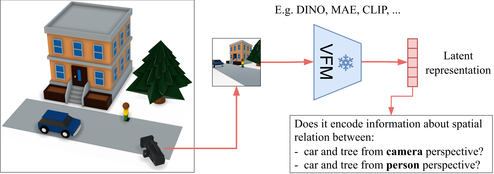
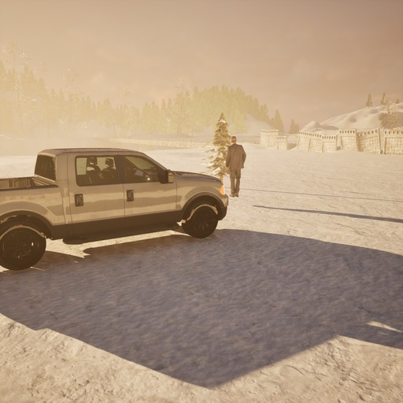
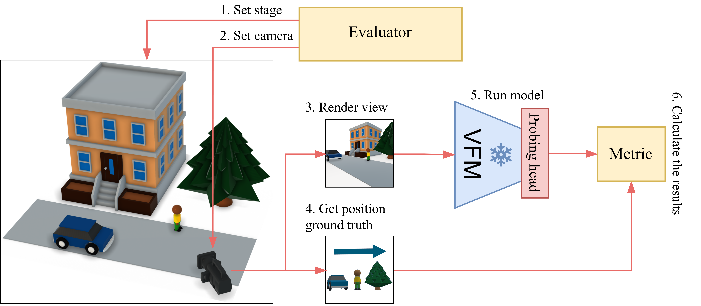

  

    <h1 class="hero-title">SpaRRTa</h1>
    

      <strong>Spa</strong>tial <strong>R</strong>elation <strong>R</strong>ecognition <strong>Ta</strong>sk 
      A Synthetic Benchmark for Evaluating Spatial Intelligence in Visual Foundation Models
    

    
    

      
      
      
      
    

    
    

      <a href="getting-started/" class="hero-btn hero-btn-primary">
        🚀 Get Started
      </a>
      <a href="https://github.com/gmum/SpaRRTa" class="hero-btn hero-btn-secondary" target="_blank">
        📦 GitHub
      </a>
      <a href="https://arxiv.org/abs/XXXX.XXXXX" class="hero-btn hero-btn-secondary" target="_blank">
        📄 Paper
      </a>
    

    
    

      

      
    

  

## Abstract

**Visual Foundation Models (VFMs)**, such as DINO and CLIP, exhibit strong semantic understanding but show limited spatial reasoning capabilities, which limits their applicability to embodied systems. Recent work incorporates 3D tasks (such as depth estimation) into VFM training. However, VFM performance remains inconsistent across different tasks, raising the question: **do these models truly have spatial awareness or overfit to specific 3D objectives?**

To address this question, we introduce the **Spatial Relation Recognition Task (SpaRRTa)** benchmark, which evaluates the representations of relative positions of objects across different viewpoints. SpaRRTa can generate an arbitrary number of photorealistic images with diverse scenes and fully controllable object arrangements, along with freely accessible spatial annotations.

  

    
🎮

    
Unreal Engine 5

    

      Photorealistic synthetic scenes with full control over object placement, camera positions, and environmental conditions.
    

  

  
  

    
🔬

    
Spatial Reasoning

    

      Evaluates abstract, human-like relational understanding beyond simple depth estimation or metric prediction.
    

  

  
  

    
👁️

    
Egocentric & Allocentric

    

      Two task variants testing camera-centric and perspective-taking spatial reasoning abilities.
    

  

  
  

    
📊

    
Comprehensive Benchmark

    

      Evaluate 13+ VFMs across 5 diverse environments with multiple probing strategies.
    

  

## Key Statistics

  

    
5

    
Environments

  

  

    
13+

    
VFMs Evaluated

  

  

    
50K+

    
Images

  

  

    
3

    
Probing Methods

  

## Key Findings

!!! success "Main Results"
    
    1. **Spatial information is patch-level**: Spatial relations are primarily encoded at the patch level and largely obscured by global pooling
    
    2. **3D supervision enriches patch features**: VGGT (3D-supervised) shows improvements only with selective probing, not linear probing
    
    3. **Allocentric reasoning is challenging**: All models struggle with perspective-taking tasks compared to egocentric variants
    
    4. **Environment complexity matters**: Performance degrades significantly in cluttered environments like City scenes

## Environments

  

    
    

      
🏔️ Winter Town

    

  

  

    
    

      
🌉 Bridge

    

  

[View All Environments →](unreal-scene-generation.md){ .md-button }

## Evaluation Pipeline

<figure markdown>
  { width="100%" }
  <figcaption>The SpaRRTa evaluation pipeline: (1) Set Stage with diverse assets, (2) Set Camera position, (3) Render photorealistic image, (4) Extract ground truth, (5) Run VFM and probe, (6) Calculate accuracy.</figcaption>
</figure>

## Authors

  

    
Turhan Can Kargin

    
Jagiellonian University

    

      <a href="mailto:turhancan.kargin@doctoral.uj.edu.pl" title="Email">✉️</a>
      <a href="https://github.com/turhancan97" title="GitHub">💻</a>
    

  

  
  

    
Wojciech Jasiński

    
Jagiellonian University, AGH

  

  
  

    
Adam Pardyl

    
Jagiellonian University, IDEAS NCBR

  

  
  

    
Bartosz Zieliński

    
Jagiellonian University

  

  
  

    
Marcin Przewięźlikowski

    
Jagiellonian University

  

## Affiliations

  
  
  
  

## Citation

If you find SpaRRTa useful in your research, please cite our paper:

  <button class="citation-copy-btn">📋 Copy BibTeX</button>
  <pre><code class="language-bibtex">@article{kargin2025sparrta,
  title={SpaRRTa: A Synthetic Benchmark for Evaluating Spatial Intelligence in Visual Foundation Models},
  author={Kargin, Turhan Can and Jasiński, Wojciech and Pardyl, Adam and Zieliński, Bartosz and Przewięźlikowski, Marcin},
  journal={arXiv preprint arXiv:XXXX.XXXXX},
  year={2025}
}</code></pre>

## Acknowledgments

This work was supported by the Polish National Science Center and conducted at the Faculty of Mathematics and Computer Science, Jagiellonian University.

---

  <a href="getting-started/" class="md-button md-button--primary">Get Started with SpaRRTa</a>
  <a href="results/" class="md-button">View Results</a>

