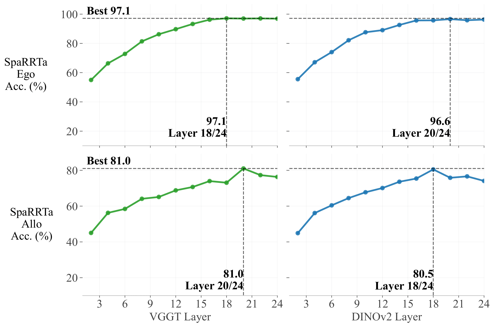

# Benchmark Results

This page presents the complete evaluation results of Visual Foundation Models on the SpaRRTa benchmark.

## Leaderboard

### Overall Rankings

The table below shows the **mean rank** across all environments and probing methods:

| Rank | Model | Mean Rank (Ego) | Mean Rank (Allo) | Overall |
|:----:|-------|:---------------:|:----------------:|:-------:|
| 🥇 | **DINO-v2 (+reg) ViT-L/14** | 1.00 | 1.20 | **1.10** |
| 🥈 | **VGGT ViT-L/14** | 2.40 | 1.20 | **1.80** |
| 🥉 | **DINOv3** | 2.80 | 2.60 | **2.70** |
| 4 | DINO-v2 ViT-B/14 | 5.00 | 4.20 | 4.60 |
| 5 | MAE | 5.00 | 8.00 | 6.50 |
| 6 | DINO-v2 (+reg) ViT-B/14 | 3.00 | 4.00 | 3.50 |
| 7 | DINO | 4.80 | 3.20 | 4.00 |
| 8 | CroCo v2 | 9.00 | 10.40 | 9.70 |
| 9 | CroCo | 10.80 | 11.20 | 11.00 |
| 10 | SPA | 9.00 | 10.00 | 9.50 |
| 11 | MaskFeat | 11.40 | 12.00 | 11.70 |
| 12 | DeiT | 9.20 | 5.80 | 7.50 |
| 13 | CLIP | 13.00 | 11.40 | **12.20** |

## Egocentric Task Results

### Complete Results Table

<figure markdown>
  { width="100%" }
  <figcaption>Impact of probing strategy on spatial accuracy across all VFMs.</figcaption>
</figure>

=== "Forest"

    | Model | Linear | AbMILP | Efficient |
    |-------|:------:|:------:|:---------:|
    | DINO | 64.76 | 85.53 | 89.28 |
    | DINO-v2 (B/14) | 59.91 | 86.36 | 91.91 |
    | DINO-v2 reg (B/14) | 60.81 | 83.81 | 91.60 |
    | **DINO-v2 reg (L/14)** | **65.37** | 86.59 | 93.92 |
    | DINOv3 | 62.41 | 84.71 | 93.93 |
    | **VGGT (L/14)** | 52.10 | **89.90** | **96.18** |
    | SPA | 52.91 | 73.01 | 78.33 |
    | CroCo | 46.25 | 75.19 | 88.98 |
    | CroCo v2 | 54.14 | 76.18 | 90.48 |
    | CLIP | 36.66 | 55.85 | 56.33 |
    | DeiT | 53.23 | 61.33 | 75.49 |
    | MAE | 62.82 | 84.26 | 93.10 |
    | MaskFeat | 47.20 | 74.60 | 89.66 |

=== "Desert"

    | Model | Linear | AbMILP | Efficient |
    |-------|:------:|:------:|:---------:|
    | DINO | 55.14 | 89.34 | 92.10 |
    | DINO-v2 (B/14) | 64.57 | **90.64** | 93.94 |
    | DINO-v2 reg (B/14) | 69.40 | 86.73 | 94.63 |
    | **DINO-v2 reg (L/14)** | **79.68** | 89.03 | 96.70 |
    | DINOv3 | 65.34 | 86.96 | 97.47 |
    | **VGGT (L/14)** | 63.42 | 90.03 | **98.78** |
    | SPA | 49.39 | 72.58 | 90.80 |
    | CroCo | 48.77 | 80.75 | 89.88 |
    | CroCo v2 | 52.53 | 81.91 | 90.88 |
    | CLIP | 37.65 | 56.29 | 68.44 |
    | DeiT | 54.75 | 52.45 | 78.22 |
    | MAE | 58.36 | 87.34 | 93.71 |
    | MaskFeat | 42.87 | 81.52 | 92.87 |

=== "Winter Town"

    | Model | Linear | AbMILP | Efficient |
    |-------|:------:|:------:|:---------:|
    | DINO | 61.97 | 87.05 | 89.32 |
    | DINO-v2 (B/14) | 58.03 | **88.41** | 93.26 |
    | DINO-v2 reg (B/14) | 65.38 | 86.59 | 91.52 |
    | **DINO-v2 reg (L/14)** | **69.02** | 85.15 | 94.92 |
    | DINOv3 | 66.14 | 83.56 | 93.18 |
    | **VGGT (L/14)** | 59.24 | 87.24 | **95.53** |
    | SPA | 49.62 | 74.01 | 90.89 |
    | CroCo | 49.32 | 83.17 | 87.95 |
    | CroCo v2 | 53.56 | 85.20 | 89.62 |
    | CLIP | 44.09 | 61.57 | 63.21 |
    | DeiT | 54.24 | 62.42 | 75.98 |
    | MAE | 62.80 | 85.84 | 93.26 |
    | MaskFeat | 47.80 | 78.63 | 91.21 |

=== "Bridge"

    | Model | Linear | AbMILP | Efficient |
    |-------|:------:|:------:|:---------:|
    | DINO | 63.34 | 89.48 | 89.86 |
    | DINO-v2 (B/14) | 66.69 | **89.63** | 93.75 |
    | DINO-v2 reg (B/14) | 67.15 | 88.49 | 93.52 |
    | **DINO-v2 reg (L/14)** | **69.59** | 89.40 | 96.11 |
    | DINOv3 | 67.29 | 87.11 | 94.82 |
    | **VGGT (L/14)** | 58.92 | 88.49 | **96.11** |
    | SPA | 56.90 | 77.06 | 88.72 |
    | CroCo | 55.57 | 81.86 | 92.68 |
    | CroCo v2 | 56.25 | 83.52 | 91.01 |
    | CLIP | 45.35 | 61.13 | 64.71 |
    | DeiT | 56.17 | 64.10 | 81.40 |
    | MAE | 62.50 | 88.11 | 93.83 |
    | MaskFeat | 53.89 | 82.85 | 92.30 |

=== "City"

    | Model | Linear | AbMILP | Efficient |
    |-------|:------:|:------:|:---------:|
    | DINO | 53.01 | 83.89 | 82.45 |
    | DINO-v2 (B/14) | 53.24 | **85.31** | 93.00 |
    | DINO-v2 reg (B/14) | 57.15 | 82.98 | 93.00 |
    | **DINO-v2 reg (L/14)** | **64.79** | 82.38 | 94.27 |
    | DINOv3 | 56.93 | 81.63 | 92.40 |
    | **VGGT (L/14)** | 46.08 | 83.99 | **94.47** |
    | SPA | 45.48 | 69.75 | 80.27 |
    | CroCo | 44.88 | 74.93 | 87.95 |
    | CroCo v2 | 43.90 | 77.93 | 85.99 |
    | CLIP | 42.92 | 62.58 | 64.67 |
    | DeiT | 43.38 | 55.50 | 76.50 |
    | MAE | 52.87 | 78.77 | 89.00 |
    | MaskFeat | 44.80 | 72.67 | 77.64 |

## Allocentric Task Results

<figure markdown>
  { width="100%" }
  <figcaption>Egocentric vs Allocentric performance comparison across all VFMs.</figcaption>
</figure>

!!! warning "Performance Gap"
    
    All models show a **significant performance drop** on the allocentric task compared to egocentric. This highlights the challenge of perspective-taking for current VFMs.

### Allocentric Performance Summary

| Model | Avg Linear | Avg AbMILP | Avg Efficient |
|-------|:----------:|:----------:|:-------------:|
| DINO | 49.07 | 62.11 | 64.38 |
| DINO-v2 (B/14) | 47.90 | 65.91 | 71.20 |
| DINO-v2 reg (B/14) | 48.23 | 63.80 | 68.06 |
| **DINO-v2 reg (L/14)** | **51.68** | **66.86** | 76.10 |
| DINOv3 | 49.51 | 60.87 | 72.05 |
| **VGGT (L/14)** | 42.70 | 65.71 | **76.65** |
| SPA | 38.37 | 55.52 | 66.14 |
| CroCo | 37.89 | 61.88 | 68.37 |
| CroCo v2 | 37.86 | 62.77 | 67.69 |
| CLIP | 36.77 | 51.40 | 54.36 |
| DeiT | 45.42 | 49.31 | 57.88 |
| MAE | 42.61 | 64.45 | 70.66 |
| MaskFeat | 35.23 | 59.26 | 69.13 |

## Environment Analysis

<figure markdown>
  { width="100%" }
  <figcaption>Performance variation across different environments.</figcaption>
</figure>

### Environment Difficulty Ranking

From easiest to hardest:

1. **Forest** - Natural complexity but clear object boundaries
2. **Desert** - Sparse, homogeneous, minimal occlusion
3. **Bridge** - Mixed complexity, infrastructure elements
4. **Winter Town** - Snow occlusion, village clutter
5. **City** - Dense urban geometry, maximum visual complexity

!!! info "Key Insight"
    
    Environmental complexity significantly affects performance. Models struggle more in **cluttered environments** (City, Winter Town) compared to **sparse environments** (Forest, Desert).

## Probing Method Comparison

<figure markdown>
  { width="100%" }
  <figcaption>Comparison of Linear Probing (CLS token) vs Efficient Probing.</figcaption>
</figure>

### Performance Hierarchy

```
Linear Probing < AbMILP < Efficient Probing
```

**Key Finding**: Spatial information is **primarily encoded at the patch level** and is largely lost through global average pooling. Selective probing mechanisms consistently unlock hidden spatial capabilities.

## Attention Visualizations

### Efficient Probing Attention Maps

<figure markdown>
  { width="100%" }
  <figcaption>Mean attention maps from Efficient Probing heads on VGGT.</figcaption>
</figure>

<figure markdown>
  { width="70%" }
  <figcaption>Individual query attention maps showing specialization to different objects.</figcaption>
</figure>

**Observation**: Different queries specialize to attend to different scene elements (source, target, viewpoint objects), enabling the probe to extract relational information.

## Correlation with Other Benchmarks

<figure markdown>
  { width="80%" }
  <figcaption>Pearson correlation between SpaRRTa and other vision benchmarks.</figcaption>
</figure>

### Key Correlations

| Benchmark | SpaRRTa-ego | SpaRRTa-allo |
|-----------|:-----------:|:------------:|
| **Depth Estimation** | r = 0.62 | r = 0.66 |
| **Camera Pose** | r = 0.62 | r = 0.59 |
| **FGVC Aircraft** | r = -0.23 | r = -0.02 |
| **Flowers102** | r = -0.19 | r = 0.02 |

!!! success "Validation"
    
    SpaRRTa shows **strong correlation with 3D geometric tasks** (depth, pose) but **no correlation with semantic classification** tasks. This confirms that SpaRRTa measures spatial awareness as an independent capability from semantic understanding.

## Layer-wise Analysis

<figure markdown>
  { width="100%" }
  <figcaption>Spatial reasoning accuracy across different transformer layers.</figcaption>
</figure>

**Finding**: Spatial information peaks at **late-intermediate layers** (18-20 for ViT-L), not the final layer. This suggests that final layers prioritize semantic abstraction over geometric detail.

## Attention Dynamics Analysis

<figure markdown>
  { width="80%" }
  <figcaption>Methodology for analyzing inter-object attention flow.</figcaption>
</figure>

### VGGT vs DINO-v2 Comparison

<div class="comparison-container">
  <div class="comparison-panel">
    <h4>DINO-v2</h4>
    <ul>
      <li>Objects attend strongly to themselves</li>
      <li>CLS token retains object attention</li>
      <li>Linear probing works moderately well</li>
    </ul>
  </div>
  <div class="comparison-panel">
    <h4>VGGT</h4>
    <ul>
      <li>Objects increasingly attend to other objects</li>
      <li>CLS token shifts to register tokens</li>
      <li>Efficient probing unlocks hidden spatial info</li>
    </ul>
  </div>
</div>

<figure markdown>
  { width="100%" }
  <figcaption>Attention flow from the global [CLS] token (top row) and human patches (bottom row) to the rest of the patches (Human, Truck, Tree, Background, [CLS] and Register) for both DINO-v2 and VGGT backbones across transformer layers. The two columns on the left show absolute attention scores for DINO-v2 and VGGT, while the right column displays the differential (VGGT - DINOv2) to quantify the divergence in attention dynamics.</figcaption> 
</figure>

---

<div style="text-align: center; margin-top: 2rem;">
  <a href="../examples/" class="md-button md-button--primary">View Code Examples →</a>
  <a href="../getting-started/" class="md-button">Get Started</a>
</div>

